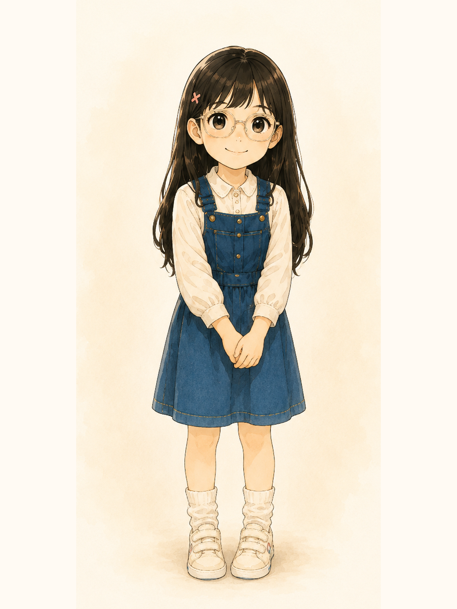
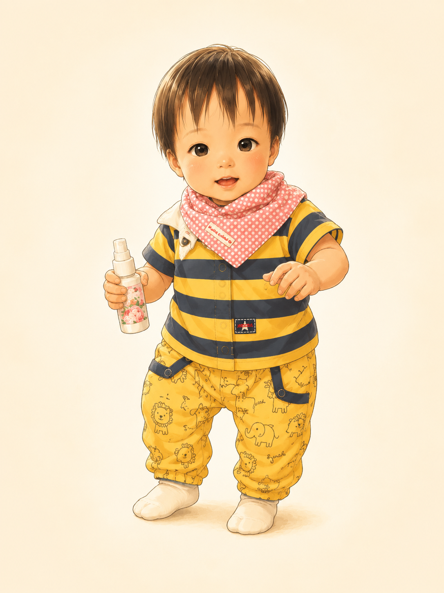

# 首頁角色圖強制刷新置換包 v3.3

你線上看到的龍弟弟仍是舊圖，代表目前網站沒有吃到最新的 `portrait-dragon.png`。
這通常是「路徑沒有覆蓋到」或「快取還在」造成。

這包用新檔名解決快取問題。

## 請新增這兩張圖到 repo

把以下檔案放到網站的圖片資料夾：

```text
assets/img/portrait-dodo-v32.png
assets/img/portrait-dragon-v32.png
```

## 請修改 index.html

把鼠姊姊圖片路徑改成：

```html

```

把龍弟弟圖片路徑改成：

```html

```

如果你的 HTML 裡是：

```html


```

就直接替換成上面的新版路徑。

## 上線後檢查

1. 打開 GitHub Pages Actions，確認 deploy 成功。
2. 用無痕視窗開首頁。
3. 或在網址後加：
   `?v=20260708-32`
4. 手機也要重新整理，不要只回到舊分頁。

## 注意

這包只處理鼠姊姊與龍弟弟兩張角色圖。
不改 Hero、不改五大入口、不改其他四位角色。
